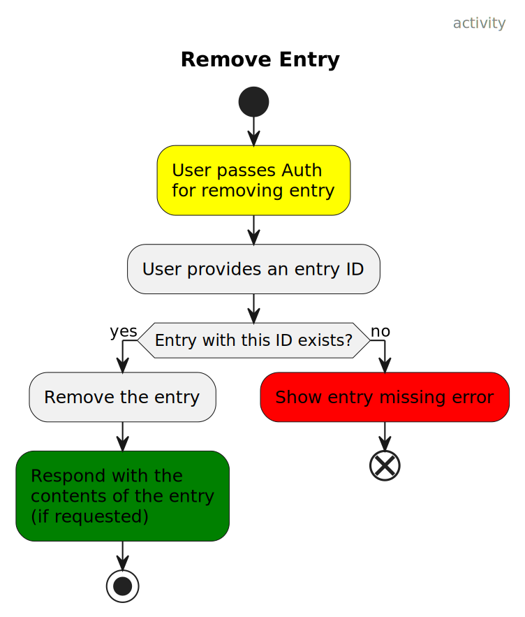
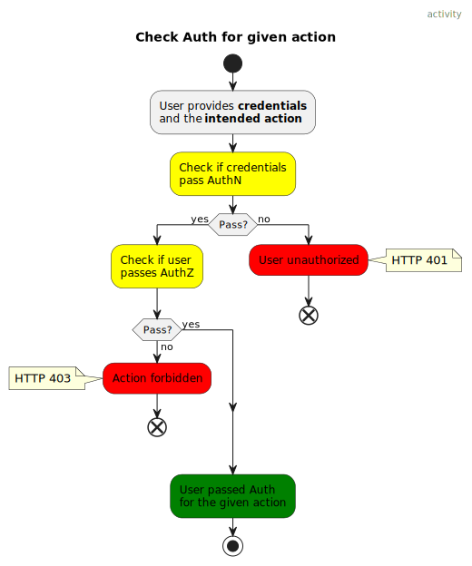
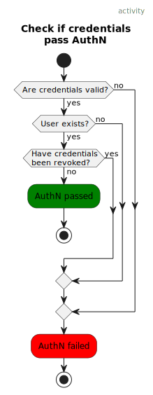
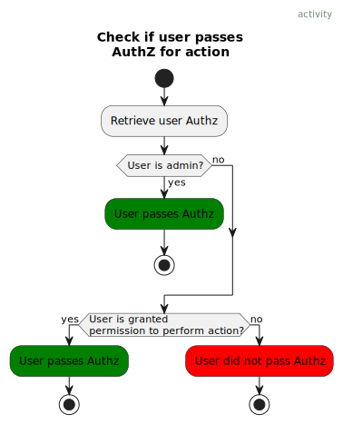

# Use cases

The following diagrams display the use-cases in `wallabago` in the
form of [Activity Diagrams](https://en.wikipedia.org/wiki/Activity_diagram).

> [!NOTE]
> 
> Source files for the diagrams in [PlantUML format](https://plantuml.com/activity-diagram-beta) are located in [`diagrams/`](./diagrams/)

> [!TIP]
>
> Open the source SVG for the digrams and you'll be able to click through them.
> Yellow blocks are clickable and will link to another diagram

