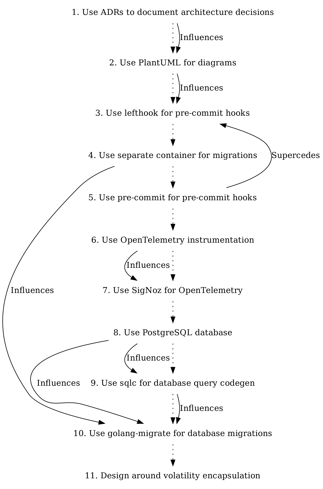

# Architecture Decision Records

<!---
This is a template injected as an intro to the ADR toc in README.md
--->

* [1. Use ADRs to document architecture decisions](0001-use-adrs-to-document-architecture-decisions.md)
* [2. Use PlantUML for diagrams](0002-use-plantuml-for-diagrams.md)
* [3. Use lefthook for pre-commit hooks](0003-use-pre-commit-hooks.md)
